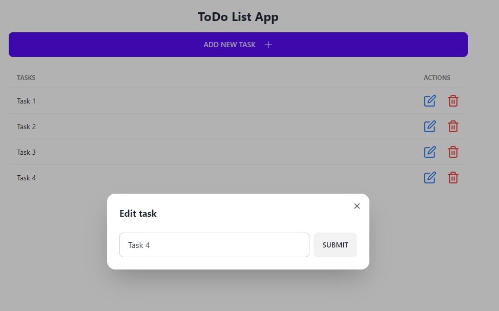

# Todo List App

This is a simple Todo List application built using Next.js, Tailwind CSS, React Icons, Daisy UI, and JSON Server. You can use this app to add, update, and delete tasks.



## Features

- Add tasks: You can add new tasks to your todo list.
- Update tasks: You can mark tasks as completed or update their descriptions.
- Delete tasks: You can remove tasks from your todo list.
- Responsive design: The app is designed to work on both desktop and mobile devices.

## Technologies Used

- [Next.js](https://nextjs.org/): A React framework for building server-rendered applications.
- [Tailwind CSS](https://tailwindcss.com/): A utility-first CSS framework for rapidly building custom designs.
- [React Icons](https://react-icons.github.io/react-icons/): A library of popular icons for React applications.
- [Daisy UI](https://daisyui.com/): A library of accessible and reusable UI components for Vue.js and React.
- [JSON Server](https://github.com/typicode/json-server): A fake REST API for prototyping and mocking.

## Getting Started

1. Clone the repository to your local machine:

   ```bash
   git clone https://github.com/your-username/todo-list-app.git
   ```

2. Install dependencies:

   ```bash
   cd todo-list-app
   npm install
   ```

3. Start the JSON Server to simulate a backend:

   ```bash
   npm run json-server
   ```

4. Start the development server:

   ```bash
   npm run dev
   ```

5. Open your browser and navigate to http://localhost:3000 to use the Todo List app.

## Usage

To add a new task, click the "Add Task" button and enter the task description.
To update a task, click the edit icon (pencil) next to the task and make your changes.
To delete a task, click the delete icon (trash can) next to the task.
